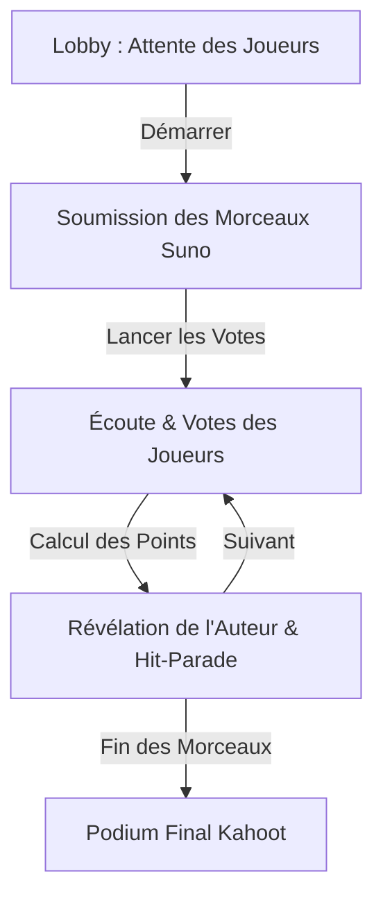

# 🎵 Suno Blind Test Game (SunoGame)

Un jeu de blind test interactif et fun en temps réel inspiré de **Kahoot**, conçu pour tester l'oreille musicale de vos amis et découvrir qui se cache derrière les créations de morceaux générés par **Suno AI** !

---

## 🚀 Fonctionnalités & Expérience Utilisateur

SunoGame propose une expérience interactive immersive en temps réel, optimisée pour un affichage sur grand écran (Host/Hôte) et sur téléphones mobiles (Players/Joueurs) :

*   **Vibe Concert & Design Premium** : Une ambiance visuelle captivante dans des tons sombres et violets néon, avec des silhouettes de scène de concert et de public en arrière-plan.
*   **Enregistrement en Temps Réel** : Synchronisation immédiate des états de la partie via **Vercel KV / Redis** pour une fluidité absolue.
*   **Connexion Facile (QR Code & Code PIN)** : Les joueurs rejoignent la partie en se rendant sur l'URL de jeu ou en scannant un QR code dynamique (qui peut être agrandi en grand au centre de l'écran hôte d'un simple clic).
*   **Soumission de Musique** : Les joueurs collent le lien de leur morceau Suno AI. Leurs rectangles passent au vert avec une coche `✓` dès qu'ils sont prêts.
*   **Phase de Vote Animée** : L'hôte joue les morceaux un par un à l'aide du lecteur Suno intégré, et les joueurs votent sur leur téléphone pour deviner le créateur.
*   **Révélation Suspense** : Un effet de "tambour tournant" fait défiler les noms rapidement avant de révéler le véritable auteur d'un morceau ! Une course de voitures animée fait avancer les scores en temps réel.
*   **Podium Kahoot Animé** : À la fin de la partie, les trois premiers sont couronnés sur un vrai podium tridimensionnel révélé étape par étape (3e, puis 2e, puis roulement de tambour de suspense complet avec spotlights et masquage du pseudo avant de révéler le grand vainqueur et de déclencher une tempête de confettis ! 🎉).
*   **Gestion des Égalités** : Système d'ex-aequo intelligent attribuant le même rang aux joueurs ayant le même nombre de points.

---

## 🛠️ Stack Technique

*   **Framework** : Next.js 16 (App Router)
*   **Langage** : TypeScript
*   **Styles** : Tailwind CSS (avec variables de couleur HSL, animations personnalisées)
*   **Base de données & Temps Réel** : Vercel KV / Redis (ioredis)
*   **Effets visuels** : Canvas-confetti, animations de montée (`rise-up`), d'apparition dynamique (`bounce-in`), et de pulsations lumineuses.

---

## ⚙️ Configuration & Installation

### Prerrequis

*   Node.js (v18+)
*   Une base de données Redis ou un projet Vercel KV configuré.

### 1. Cloner le dépôt et installer les dépendances

```bash
npm install
```

### 2. Variables d'environnement

Créez un fichier `.env.local` à la racine du projet et ajoutez vos accès Vercel KV / Redis :

```env
KV_URL="redis://..."
KV_REST_API_URL="https://..."
KV_REST_API_TOKEN="..."
KV_REST_API_READ_ONLY_TOKEN="..."
```

### 3. Lancer en local (Mode Développement)

```bash
npm run dev
```

Ouvrez [http://localhost:3000](http://localhost:3000) dans votre navigateur.
*   Accédez à `/host` pour lancer la room de jeu en tant que présentateur.
*   Accédez à `/play` pour rejoindre une room en tant que joueur.

### 4. Compiler pour la production

```bash
npm run build
npm start
```

---

## 🎮 Déroulement d'une Partie



1.  **Lobby** : L'hôte affiche l'écran avec le Code PIN et le QR Code. Les joueurs rejoignent avec leur pseudo.
2.  **Soumission** : Chaque joueur soumet un lien vers un morceau créé avec Suno AI.
3.  **Votes** : Les morceaux sont joués un à un. Les joueurs choisissent sur leur écran qui selon eux a écrit la chanson, puis notent la qualité de la musique.
4.  **Révélation** : L'hôte lance l'animation de révélation. Les points sont attribués :
    *   **500 points** pour les joueurs ayant deviné le bon créateur.
    *   **Points bonus** pour le créateur en fonction de la note moyenne attribuée à sa chanson.
5.  **Podium** : Une fois toutes les chansons passées, le classement final est révélé avec les animations de podium !
